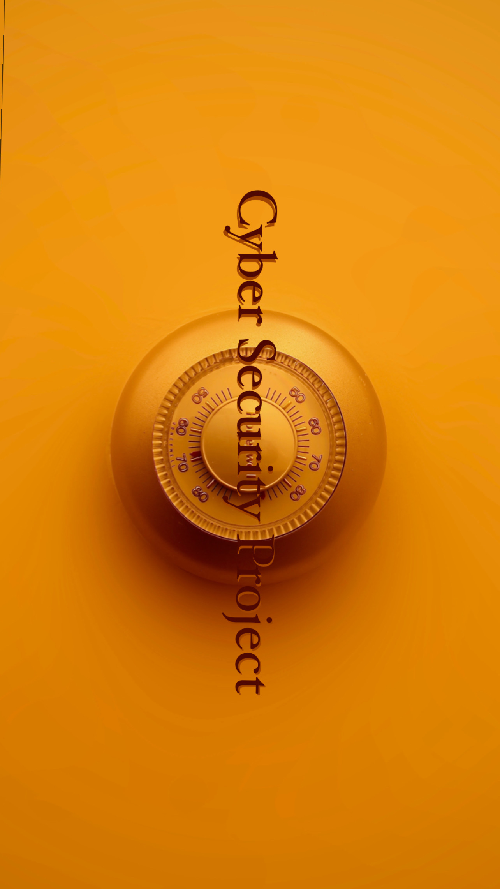
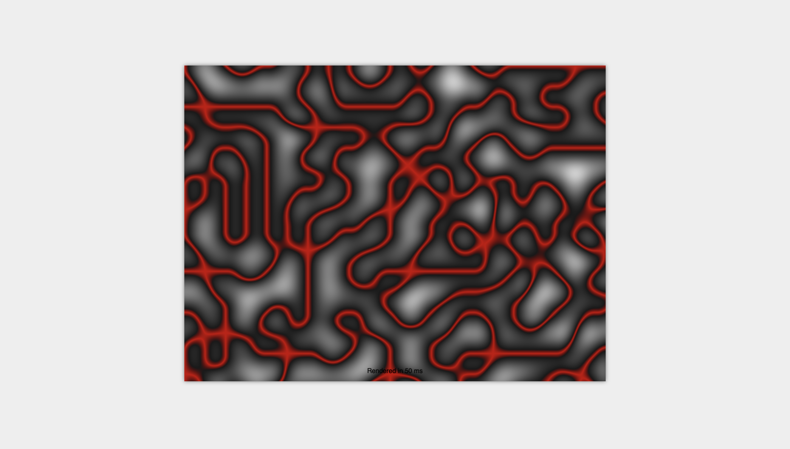

<p align="center">
  
</p>

<br/>

<p align="center">
  <a href="https://in.linkedin.com/in/r0m" target="_blank">
    
  </a>
  <a href="https://choosealicense.com/licenses/mit/" target="_blank">
    
  </a>

</p>

# 🏦 Cyber Security Project

Welcome to the **AES Bank Encryption** - the banking app that puts your security first! 💰🔒 Whether you're checking your balance, making a deposit, or transferring funds, our cutting-edge encryption keeps your financial data safe and sound.

<p align="center">
  
  Demostration of Perlin Function (2D)
</p>

## Introduction 🌟

In the ever-evolving landscape of technology, ensuring the security of your financial transactions is of paramount importance. The **AES Bank Encryption** project is your fortress of safety, where advanced encryption techniques meet modern banking needs. From safeguarding your personal information to enabling seamless transactions, we've got you covered.

<p align="center">
  
  Demostration of Perlin Function (3D)
</p>

## Features and Interfaces 🚀

1. **Landing Page** - Your gateway to the world of secure banking!
   
   

2. **Profile Page** - Manage your personal details with confidence.
   
   

3. **Deposit Page** - Seamlessly add funds to your account.
   
   

4. **Withdraw Page** - Effortlessly withdraw money whenever you need.
   
   

5. **Transfer Money Page** - Send money securely to friends and family.
   
   

6. **About Page** - Get to know us better and our commitment to your security.
   
   

## Instructions 🌐

1. **Clone the Repository**: Get started by cloning the repository to your local machine.
```
git clone https://github.com/docflex/Cyber-Security-Project.git
```

2. **Install Dependencies**: Install the required dependencies using npm.

```
npm install
```


3. **Create .env File**: Create a `.env` file and add your relevant credentials.

4. **Run the Server**: Navigate to the `server` directory and start the server.

```
cd ./server
npm run devStart
```


5. **Run the App**: Navigate to the `client` directory and start the app.

```
cd ./client
npm start
```

6. **Access the App**: The app is now running at http://localhost:3000. Enjoy secure banking!

Feel the power of AES encryption while managing your finances! Contribute and enhance the security of the app in our [GitHub repository](https://github.com/docflex/Cyber-Security-Project). Let's bank on safety together! 💪🔐
